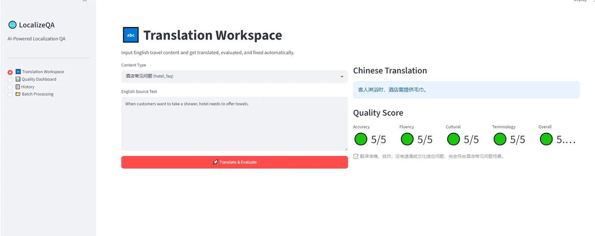
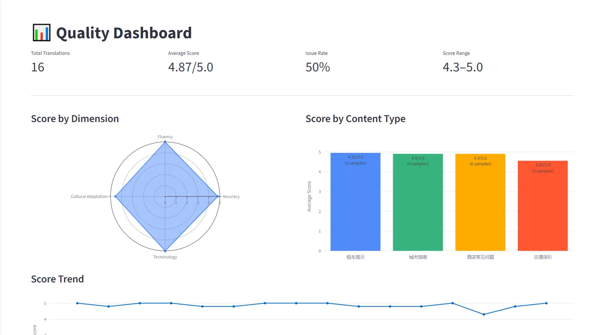
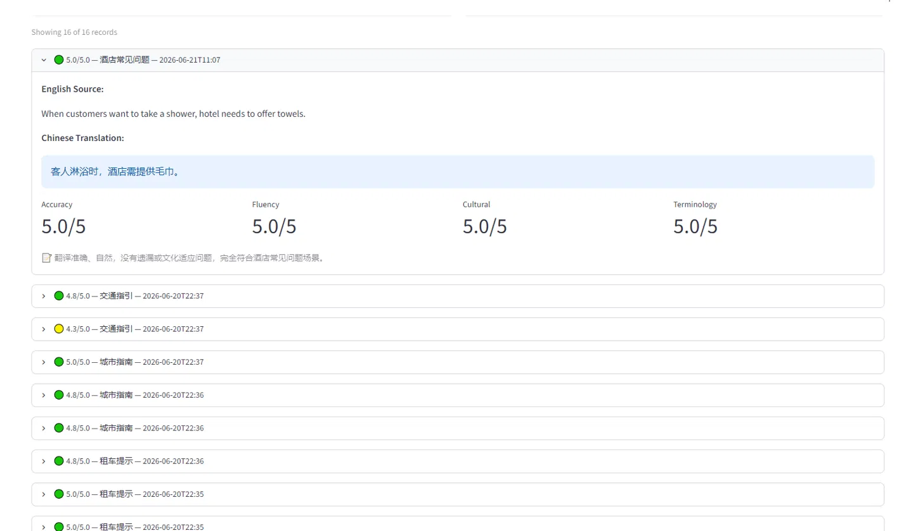
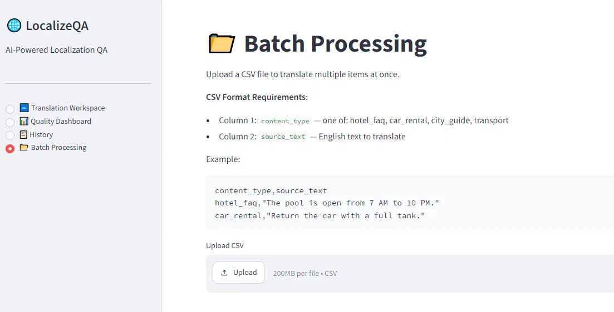

# 🌐 LocalizeQA — AI-Powered Localization Quality Assessment

An automated system that translates English travel content into culturally adapted Simplified Chinese, evaluates translation quality across four dimensions, and generates targeted fixes — all powered by LLMs.

## Screenshots

| Translation Workspace | Quality Dashboard |
|---|---|
|  |  |

| Translation History | Batch Processing |
|---|---|
|  |  |

## The Problem

Travel platforms need to localize content (hotel FAQs, car rental tips, city guides) into dozens of languages. Manual translation QA is slow, expensive, and inconsistent. AI translation is fast but often misses cultural nuances — a Chinese traveler doesn't need to know prices in USD without RMB context, or read about Uber when Didi is the norm.

## The Solution

LocalizeQA automates the full localization QA pipeline:

1. **Translate** — English → Chinese with cultural adaptation (not just word-for-word)
2. **Evaluate** — Score across 4 dimensions: Accuracy, Fluency, Cultural Adaptation, Terminology
3. **Fix** — Auto-generate improved translations targeting specific flagged issues

Built from real-world experience doing AI localization QA at Welo Data (Welocalize).

## Key Features

- **Four-Dimension Evaluation** — Goes beyond "good/bad" with granular scoring and specific issue identification
- **Anti-Bias Calibration** — Prompt engineering techniques to prevent LLM self-evaluation bias (a common pitfall documented during development)
- **Automated Benchmark** — 12-sample test suite covering hotels, car rentals, city guides, and transport
- **Quality Dashboard** — Radar charts, score trends, content type comparison, and common issue tracking
- **Batch Processing** — Upload CSV for bulk translation and evaluation
- **Persistent Storage** — SQLite database tracks all translations for trend analysis

## Architecture

```
┌─────────────────────────────────────────────────┐
│                 Streamlit Web UI                │
│  ┌──────────┐ ┌──────────┐ ┌─────────────────┐ │
│  │Workspace │ │Dashboard │ │Batch Processing │ │
│  └────┬─────┘ └────┬─────┘ └───────┬─────────┘ │
│       │             │               │           │
├───────┼─────────────┼───────────────┼───────────┤
│       ▼             ▼               ▼           │
│  ┌──────────────────────────────────────────┐   │
│  │           Core Pipeline                  │   │
│  │  translator.py → evaluator.py → fixer.py │   │
│  └──────────────────┬───────────────────────┘   │
│                     │                           │
│  ┌──────────────────▼───────────────────────┐   │
│  │         database.py (SQLite)             │   │
│  └──────────────────────────────────────────┘   │
│                     │                           │
├─────────────────────┼───────────────────────────┤
│                     ▼                           │
│            DeepSeek V4 API                      │
└─────────────────────────────────────────────────┘
```

## Tech Stack

| Layer | Technology |
|-------|-----------|
| LLM API | DeepSeek V4 (OpenAI-compatible) |
| Backend | Python 3.10+ |
| Database | SQLite |
| Web UI | Streamlit |
| Visualization | Plotly |
| Deployment | Local / Streamlit Cloud (optional) |

## Quick Start

### Prerequisites
- Python 3.10+
- DeepSeek API key ([get one here](https://platform.deepseek.com/))

### Installation

```bash
git clone https://github.com/YOUR_USERNAME/LocalizeQA.git
cd LocalizeQA
pip install -r requirements.txt
cp .env.example .env
# Edit .env and add your DeepSeek API key
```

### Usage

```bash
# Web interface
streamlit run app.py

# Command line
python main.py

# Run benchmark (12 test samples)
python benchmark.py
```

## Benchmark Results

Tested on 12 curated travel content samples across 4 content types:

| Metric | Value |
|--------|-------|
| Overall Average Score | 4.87 / 5.0 |
| Issue Detection Rate | 50% |
| Weakest Dimension | Cultural Adaptation (4.53) |
| Strongest Dimension | Fluency (5.0) |
| Most Challenging Type | Transport (4.55) |

**Key Finding:** The most common issue is missing RMB currency conversion — DeepSeek's translation module doesn't proactively add local currency equivalents, requiring explicit prompt instructions.

## Technical Decisions

### Anti-Bias Calibration
LLMs tend to rate their own output highly (self-evaluation bias). Initial testing showed 100% of translations receiving 5/5 scores. Solution: Added calibration instructions to the evaluation prompt specifying that 5 should be rare, most good translations score 3-4, and the model must re-read if all dimensions show zero issues.

### JSON Parsing Resilience  
DeepSeek V4's thinking mode occasionally returns empty content or malformed JSON. The evaluator implements a 3-layer parsing strategy: extract JSON boundaries → clean trailing commas/comments → retry on failure. This brought the parse success rate from ~60% to ~95%.

### Modular Pipeline Design
Each stage (translate → evaluate → fix) is an independent module with a clean function interface. This enables testing each component in isolation and swapping the underlying LLM without touching the pipeline logic.

## Project Structure

```
LocalizeQA/
├── app.py               # Streamlit web interface
├── main.py              # CLI entry point
├── translator.py        # Translation module
├── evaluator.py         # Quality evaluation module
├── fixer.py             # Auto-fix module
├── database.py          # SQLite storage layer
├── benchmark.py         # Automated benchmark runner
├── requirements.txt     # Python dependencies
├── .env.example         # API key template
├── .gitignore           # Git ignore rules
└── .streamlit/
    └── config.toml      # Streamlit configuration
```

## Roadmap

- [ ] REST API (FastAPI)
- [ ] Docker containerization
- [ ] Support additional target languages (Japanese, Spanish)
- [ ] Human-in-the-loop annotation interface for evaluation calibration
- [ ] A/B comparison between different LLM providers

## License

MIT

## Author

Built by Jie Xu — CS undergraduate at University of the People, with experience in AI localization QA at Welo Data (Welocalize).
